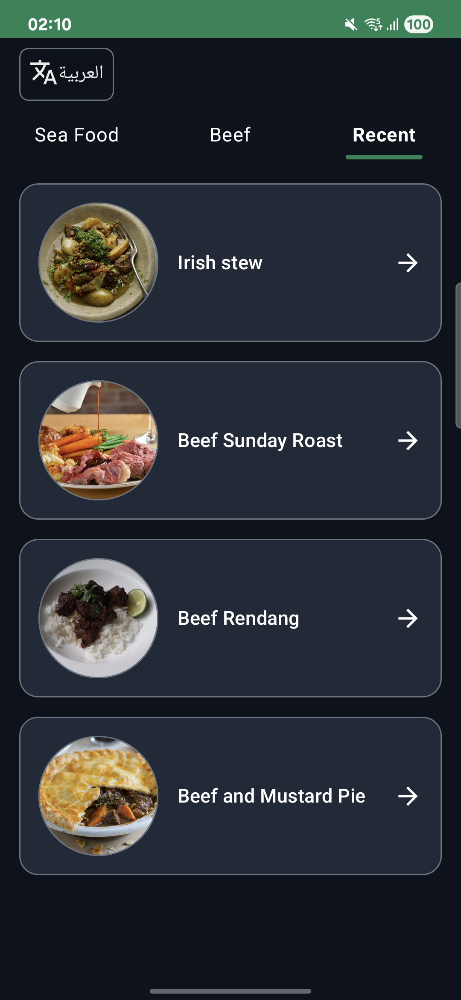
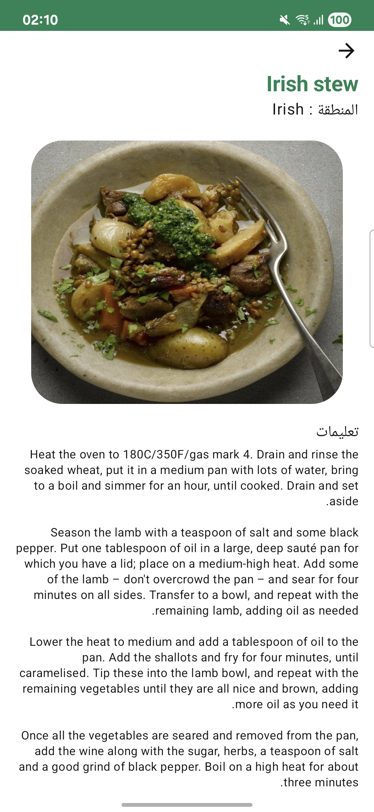
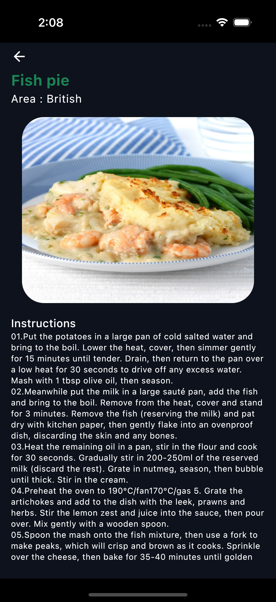
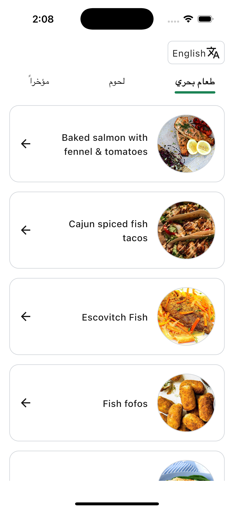

# 📱 Intermediate Software Engineer Assignment
**Kotlin Multiplatform with Shared UI (Compose Multiplatform)**

---

## 📐 **Architecture Overview**

This project follows **Clean Architecture** principles using the **MVI (Model–View–Intent)** pattern.  
The codebase is modular and separated into the following layers:

### 🗂 **Folder Structure**
data # Handles networking and local persistence
domain # Pure Kotlin layer (no external dependencies)
presentation # UI layer using MVI and Compose Multiplatform

## 🧱 **Layer Responsibilities**

### 🔹 **Data Layer**
- Handles both **remote** and **local** data sources.
- **Remote:** [Ktor Client](https://ktor.io/docs/getting-started-ktor-client.html) for API calls.
- **Local:** [SQLDelight](https://github.com/cashapp/sqldelight) for database caching.

### 🔹 **Domain Layer**
- Contains **pure Kotlin code only**.
- No external dependencies or references to other layers.
- Includes:
  - Abstract repository interfaces (no implementation).
  - Business logic inside **Use Cases**.

### 🔹 **Presentation Layer**
- Built using **Jetpack Compose Multiplatform** with **MVI architecture**.
- Contains:
  - UI Screens
  - ViewModels
  - State & Intent definitions

---

## 🧩 **Dependency Injection**

- Uses [Koin](https://insert-koin.io/) for managing dependencies.
- All modules (data, domain, presentation) are wired through Koin definitions.

---

## 🌍 **Multiplatform Features**

### 🌓 **Dark Mode**
- Follows system-wide **Light/Dark** theme preference.

### 🌐 **Localization**
- Full support for **English (LTR)** and **Arabic (RTL)**.
- All labels and layouts automatically adjust based on language.

### 🧠 **Recent Meals (Local Caching)**
- Third tab labeled `Recent` shows the **last 10 meals** clicked by the user.
- Ensures:
  - **No duplication**
  - **Instant loading** from local DB (not from API)

---

## ♿ **Accessibility**

- Images include **content descriptions**.
- Text fields have default accessibility support through labels.

---

## ❌ **Error Handling**

- User-friendly error handling with a **Retry** button.
- Example: Disable internet before launching the app to test it.

---

## 🚀 **Build & Run Instructions**

### ✅ **Android**
1. Open the project in **Android Studio Hedgehog or newer**.
2. Select the `androidApp` configuration.
3. Click **Run ▶️** to launch on emulator or device.

### 🍏 **iOS (Simulator)**
1. Install the latest version of **Xcode**.
2. Navigate to the iosApp folder and open the Xcode project:
   ```bash
   cd iosApp && open iosApp.xcodeproj
3. Click **Run ▶️** to launch on simulator or device.

## 📸 **Screenshots**
| Android                                              |                                                    |
|------------------------------------------------------|----------------------------------------------------|
|  |  |

| iOS                                         | iOS                                         |
|---------------------------------------------|---------------------------------------------|
|  |  |
